# EIYARO Node Install Manual

To get started, follow the link for the most recent release https://github.com/EIYARO-Project/core/releases
As of this writing, the most recent release is `EIYARO v1.0.3`.

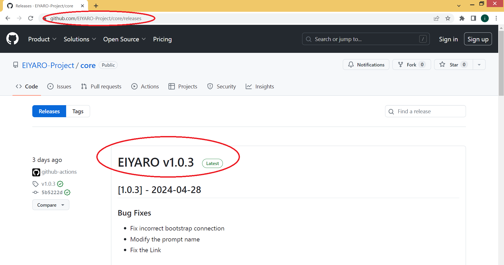

Below the release description you will find download links. If you are a Windows user, choose `eiyaro-1.0.3-windows_amd64.zip` if you are a Linux user `eiyaro-1.0.3-linux_amd64.tgz` Keep in mind that if you are a Windows user, your operating system must be `x64-bit`. Node will not work on `32-bit` versions!

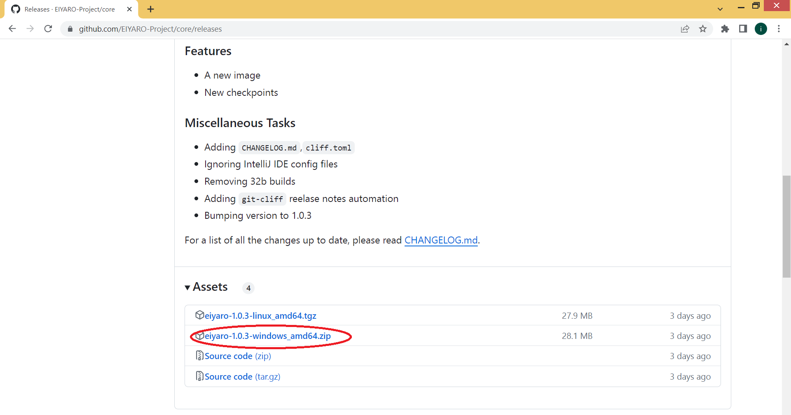

Download the selected archive to your computer (for example, to the D: drive), open it with any archiver (for example, WinRAR) and extract the `eiyarod-windows_amd64.exe` file from the archive to your disk. After that the `eiyaro-1.0.3-windows_amd64.zip` archive can be deleted.


Next, we go to the "**Start**" menu, and select "**Run**". In the window that appears, type `cmd` and click `OK`.

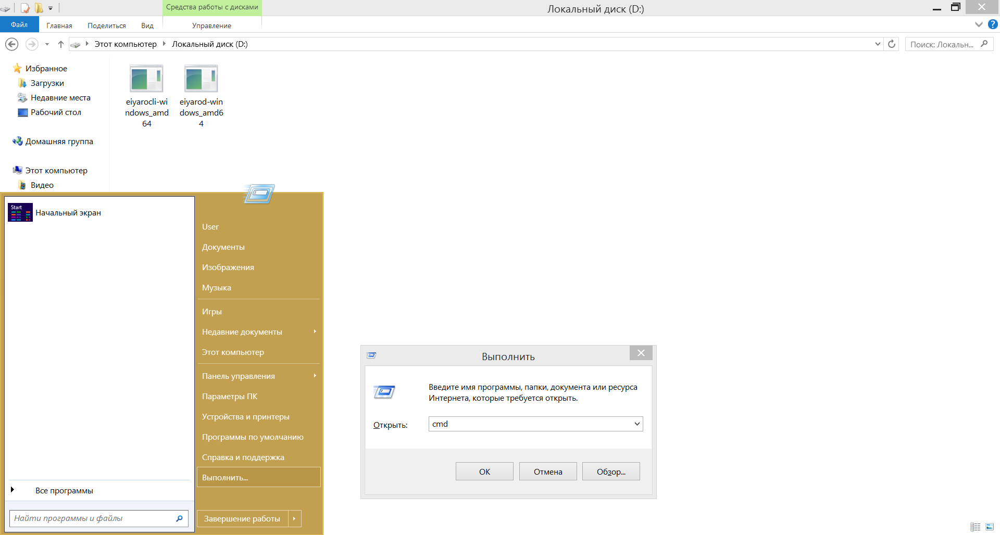

A command line window has opened. We need to go to the folder where your `eiyarod-windows_amd64.exe` file is located. In this case, we need to go to the `D:\` drive. To do this, type `D:` in the command line and press `ENTER`.

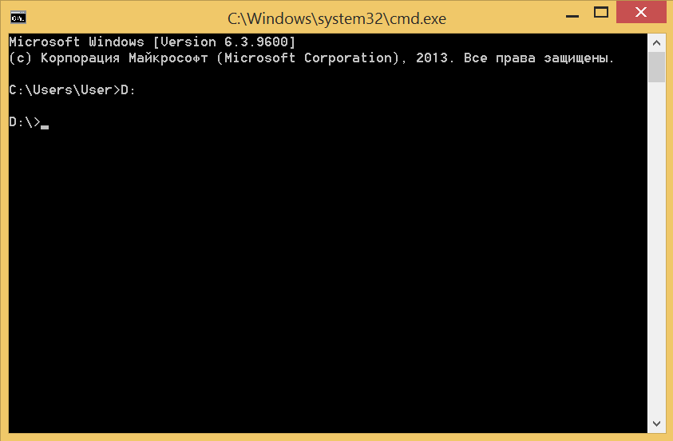

Then enter the command:
```console
> eiyarod-windows_amd64 init --chain_id mainnet 
```
and press `ENTER`.

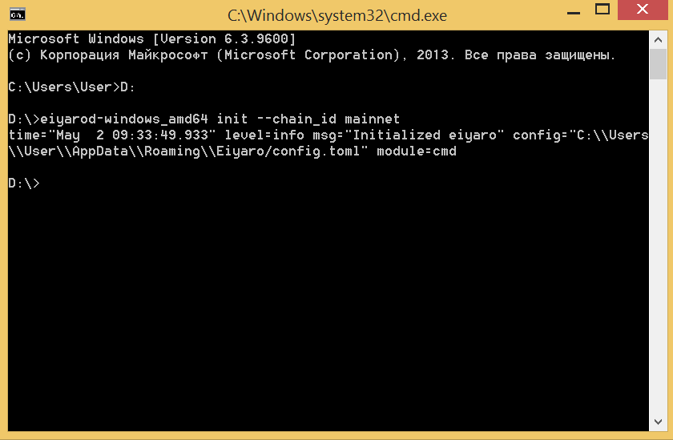

Now click "**Start**" again and select "**Run**" and type `C:\Users\%username%\AppData\Roaming\Eiyaro\` and click `OK`.

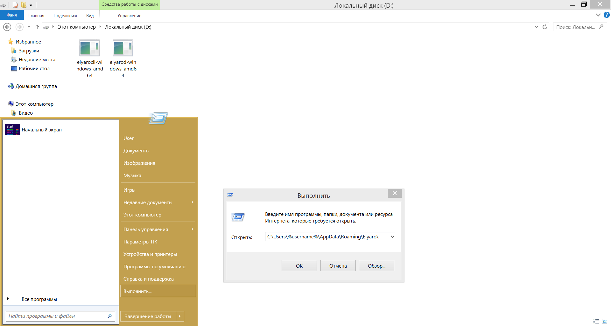

We will open the `EIYARO` folder, in which there is a `config.toml` file, right click on it and open it with Notepad.

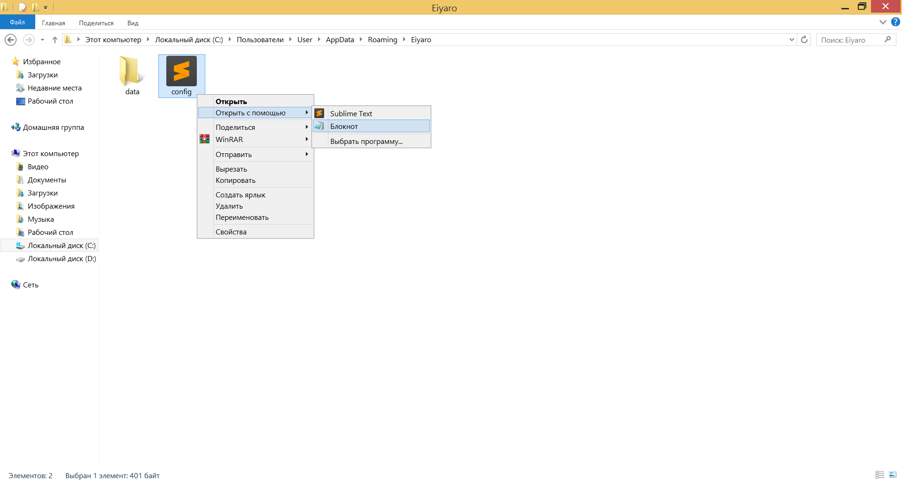

Replace the contents of the file in Notepad with the following text:

```toml
# This is a TOML config file.
# For more information, see https://github.com/toml-lang/toml
fast_sync = true
db_backend = "leveldb"
api_addr = "0.0.0.0:9888"
node_alias = "MyMostAwesomeNodeAlias"
moniker = "MyMostAwesomeNode"
chain_id = "mainnet"
[p2p]
laddr = "tcp://0.0.0.0:46657"
lan_discoverable = false
seeds = "148.135.99.102:46657,217.194.133.61:46657,154.201.78.187:46657,103.115.46.201:46657,154.44.8.62:46657,24.233.3.133:46657,27.25.156.254:46657"
keep_dial = "148.135.99.102:46657,217.194.133.61:46657,154.201.78.187:46657,103.115.46.201:46657,154.44.8.62:46657,24.233.3.133:46657,27.25.156.254:46657"
max_num_peers = 50
```

To make it look like the picture below and save the file.

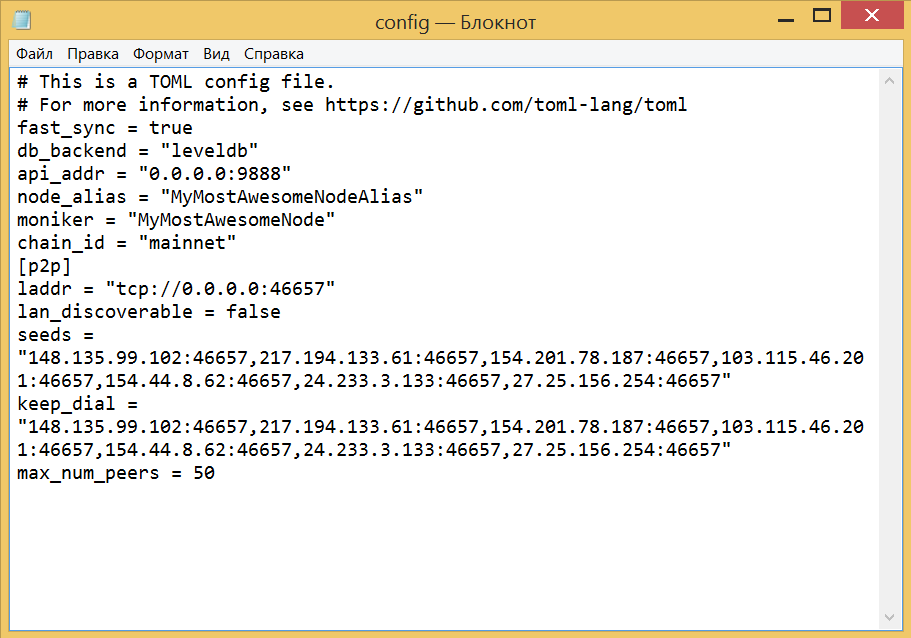

After that, go back to the command line, type:
```console
> eiyarod-windows_amd64 node
```
and press `ENTER`.


Immediately after that, a browser window will open (in our case, it's `Chrome`). 

If not, add the following lines to the `config.toml` file:

```toml
[web]
closed = true
```

To put it this way:

```toml
# This is a TOML config file.
# For more information, see https://github.com/toml-lang/toml
fast_sync = true
db_backend = "leveldb"
api_addr = "0.0.0.0:9888"
node_alias = "MyMostAwesomeNodeAlias"
moniker = "MyMostAwesomeNode"
chain_id = "mainnet"
[p2p]
laddr = "tcp://0.0.0.0:46657"
lan_discoverable = false
seeds = "148.135.99.102:46657,217.194.133.61:46657,154.201.78.187:46657,103.115.46.201:46657,154.44.8.62:46657,24.233.3.133:46657,27.25.156.254:46657"
keep_dial = "148.135.99.102:46657,217.194.133.61:46657,154.201.78.187:46657,103.115.46.201:46657,154.44.8.62:46657,24.233.3.133:46657,27.25.156.254:46657"
max_num_peers = 50
[web]
closed = true
```

After that, go back to the command prompt and type the command:

```console
> eiyarod-windows_amd64 node
```

and press `ENTER`.

Then, in a browser window (in our case, it's `Chrome`), type http://127.0.0.1:9888/ into the address bar and press `ENTER`.

This will load the EIYARO web interface page, where you will need to select **Create Wallet** to create a wallet, or **Restore by Mnemonic** to restore the wallet by entering a mnemonic phrase. Select **Create Wallet** and click **Create Wallet**.

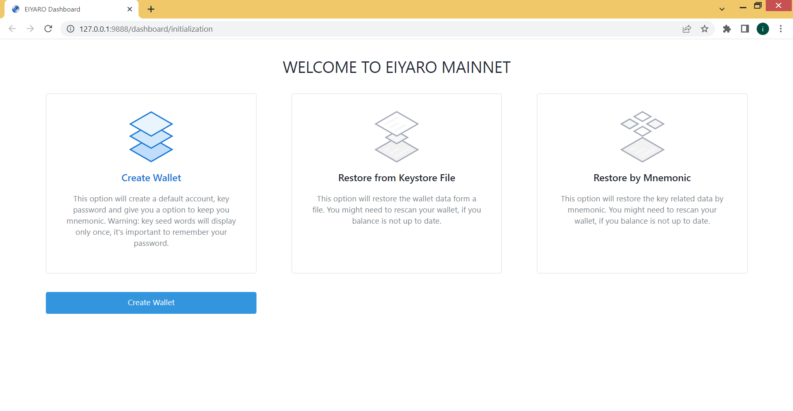

In the window that appears, enter the desired account name in the **ACCOUNT ALIAS** and **KEY ALIAS** fields, and your password in the **KEY PASSWORD** and **REPEAT YOUR KEY PASSWORD** fields, then click the **Register** button.

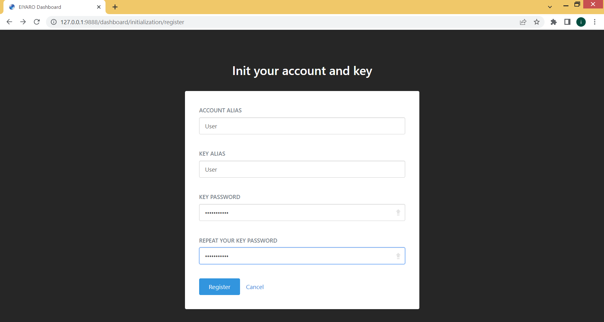

The next window will give you your 12-word mnemonic phrase. For convenience, click on the icon next to the word mnemonic on the right to copy your mnemonic phrase to the clipboard, then paste it into a text file in Notepad and save the file with your mnemonic phrase.

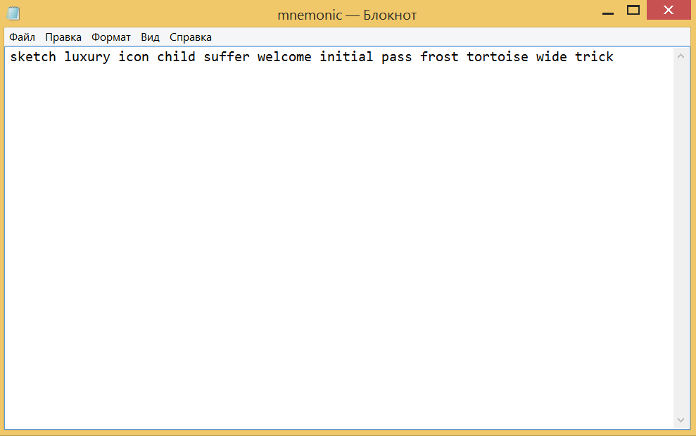

Do not store the file on a computer connected to the Internet or accessed by someone other than you. It is better to save the text file with the mnemonic phrase on a separate flash drive, or better on 3 different flash drives in case one of them fails.

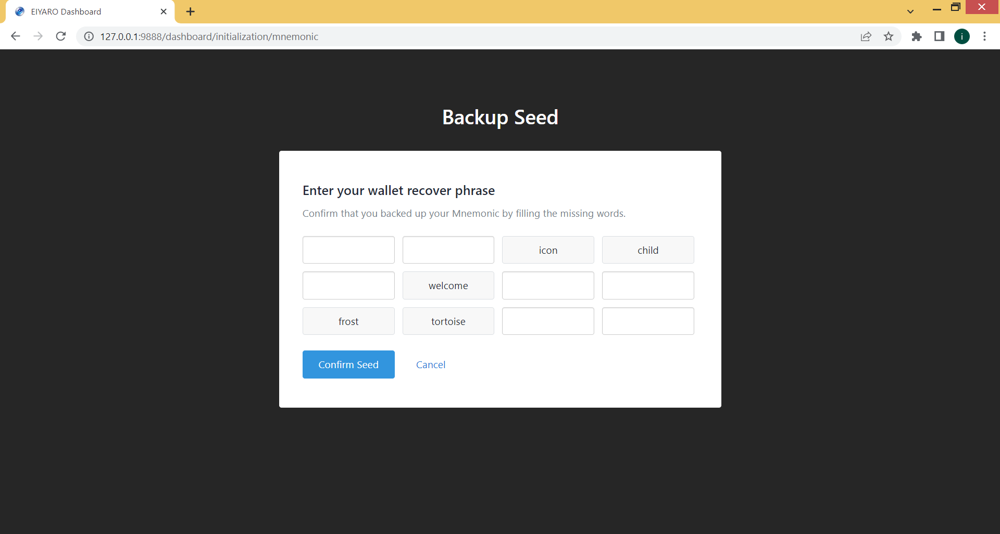

To move on, click on **I have written down the seed** and type the missing words of your mnemonic phrase into the empty fields, then click **Confirm Seed**.

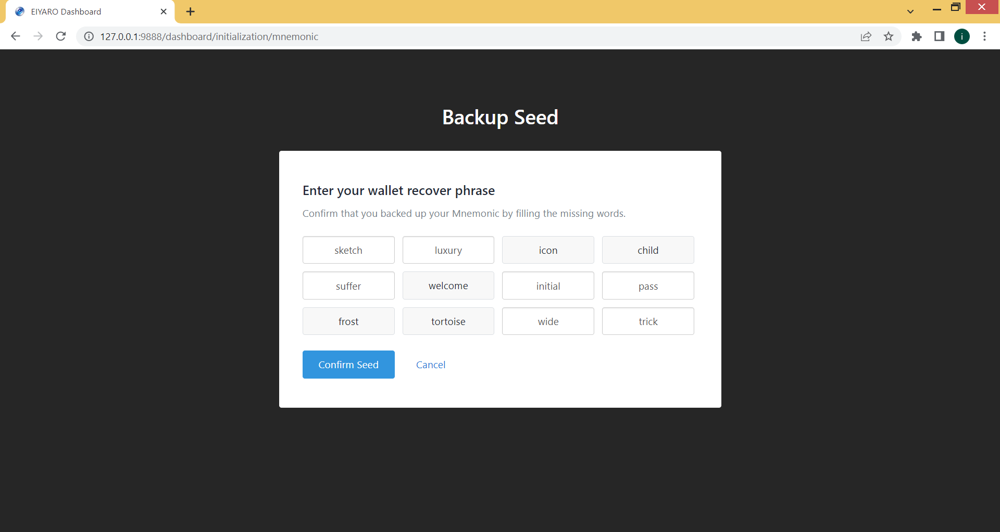

This is the web interface of your node. Please note that at the first launch your node is synchronised with nodes in the network (in the lower left corner **MAINNET SYNC STATUS Synchronising**...), and it takes time. Wait for full synchronisation, after which you will be able to see your balance under **Balances** and the list of transactions under **Transactions**. Do not close the command line window, otherwise synchronisation will be interrupted and the Web Interface will stop working.

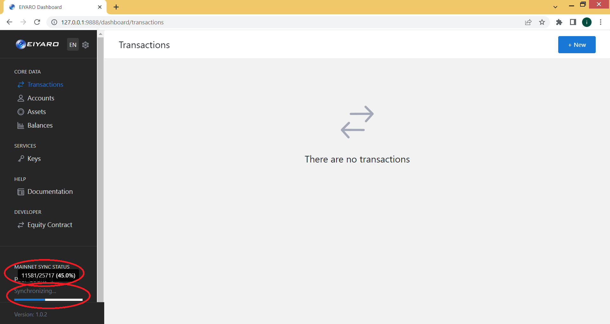

You can find out your wallet address in the **Accounts** menu item, here you can see your account name, account ID. Click on the right **View Details** to view more information and to find out your `EIYARO` wallet address.

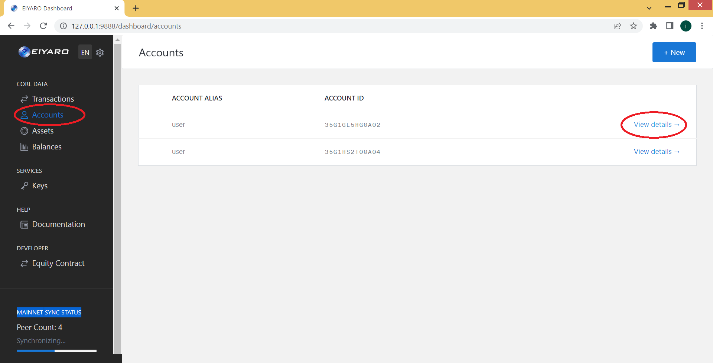

On the next page, you can see your wallet address at the very bottom.

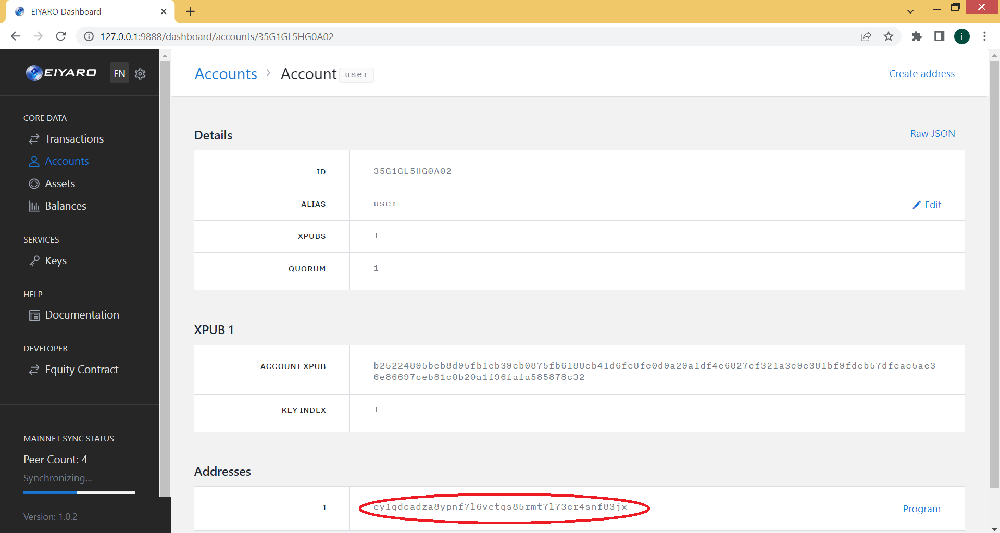

To send funds to another wallet you need to select the **Transactions** menu item, where you will see the charges and at the top right click the **+New** button to create a new transaction.

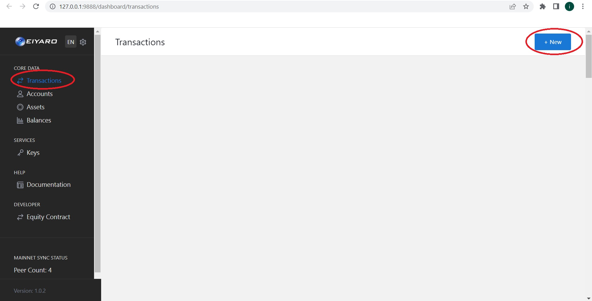

Further in the first field **Account** you specify the name of your account (what you specified when creating a wallet in the field **Alias**), and in the second field **Asset** - just write "**EY**".

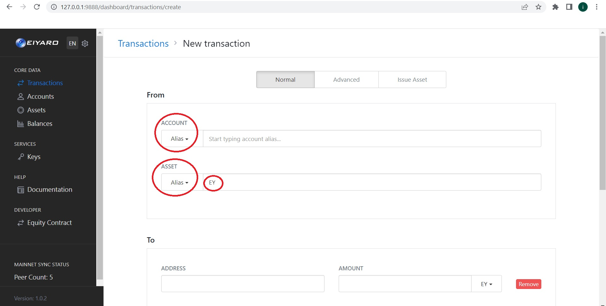

Below you will need to specify the address in the **ADDRESS** field to which you are sending funds and in the **AMOUNT** field the number of `EY` coins you want to send, then click **Submit transaction** to send the coins to the specified address.

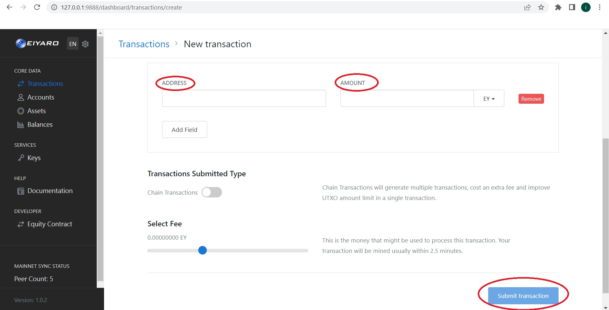
