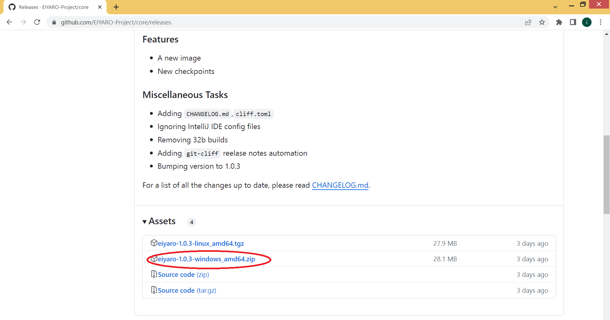
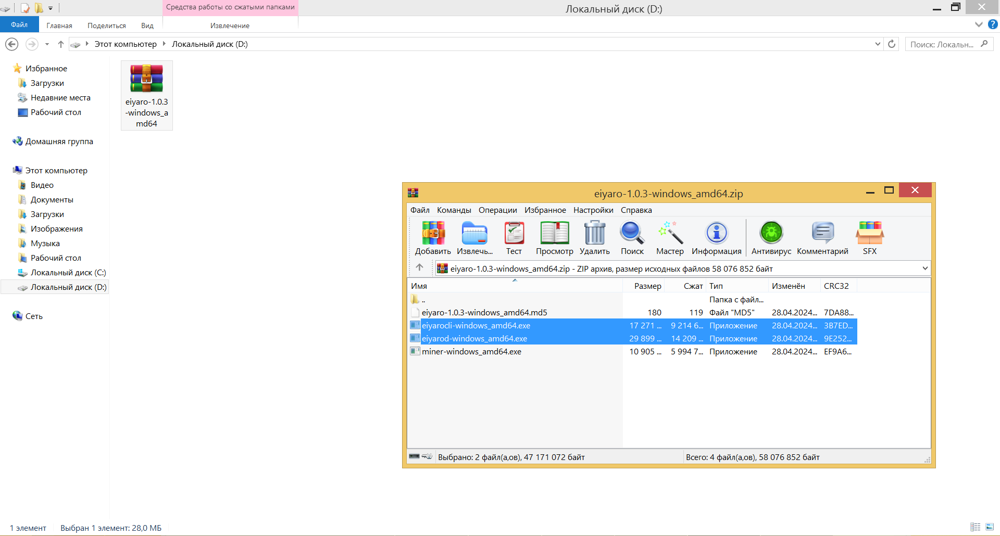
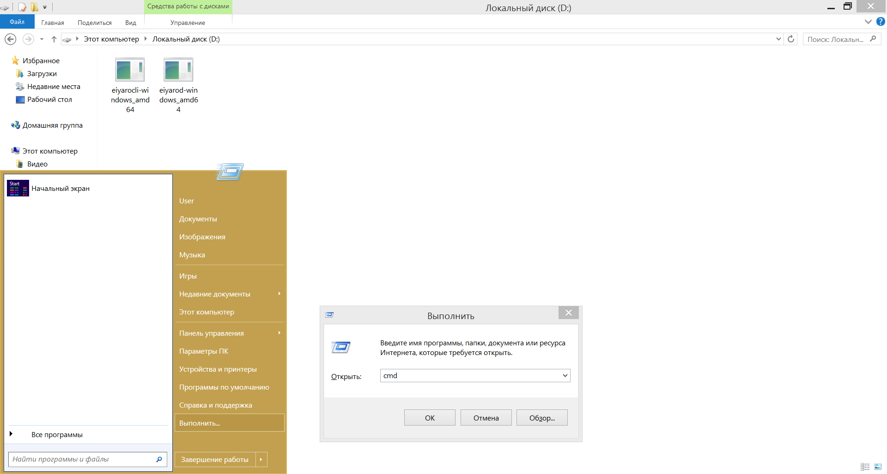
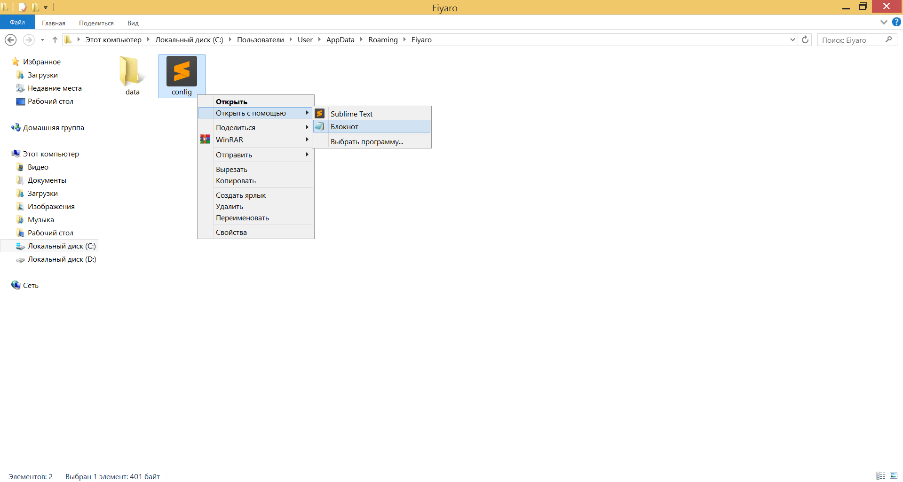
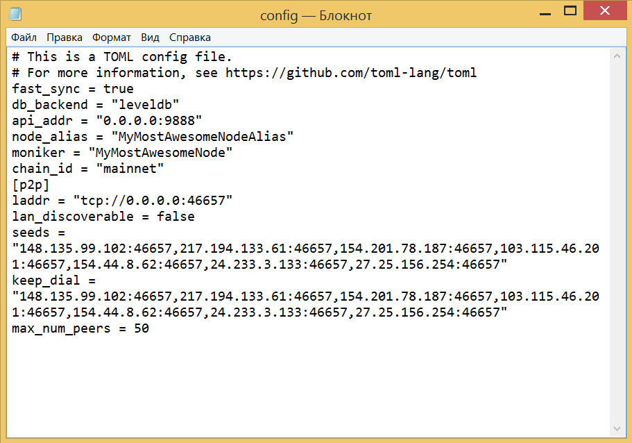
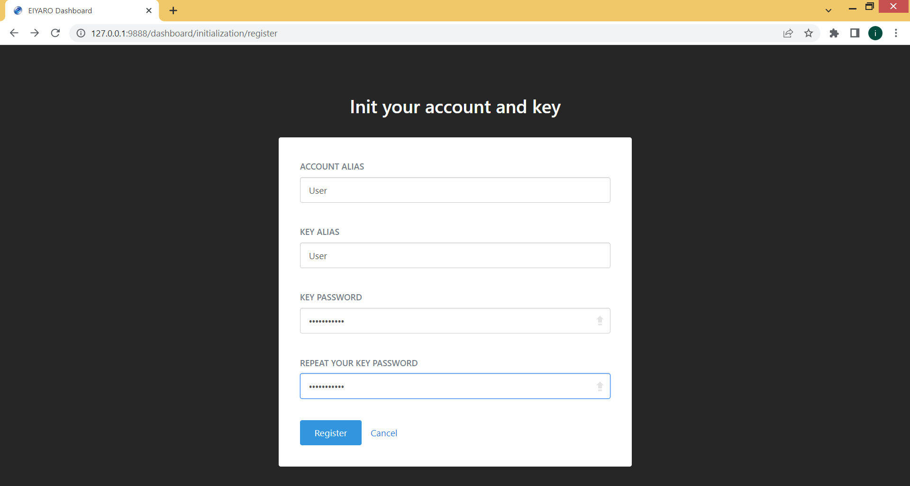
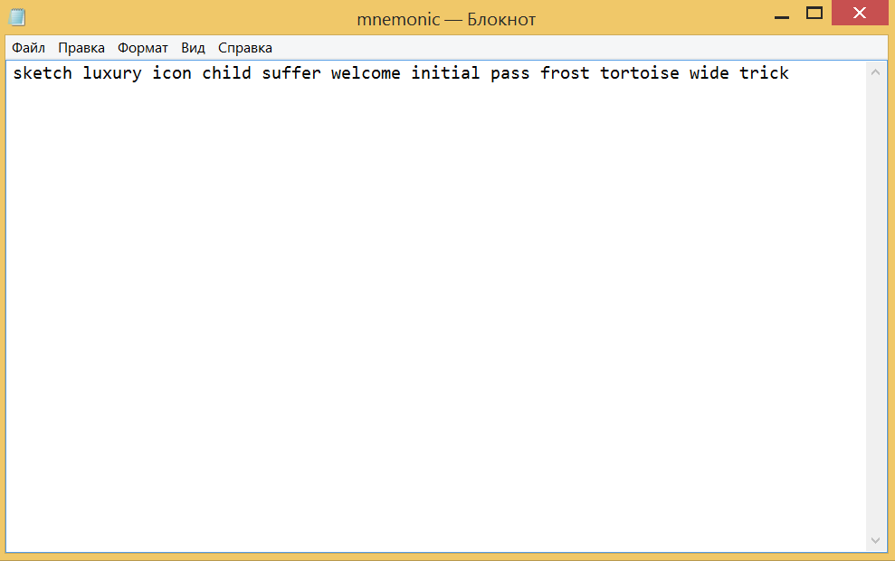
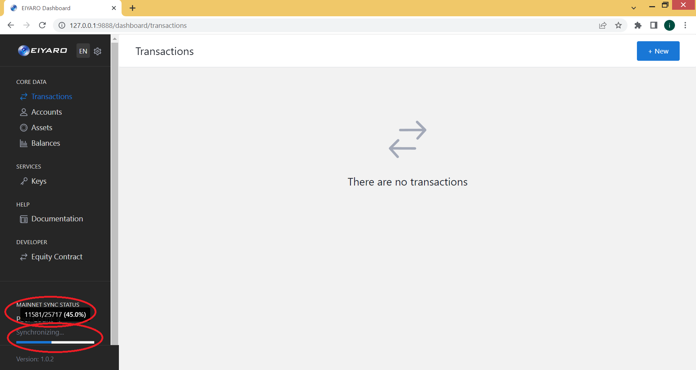
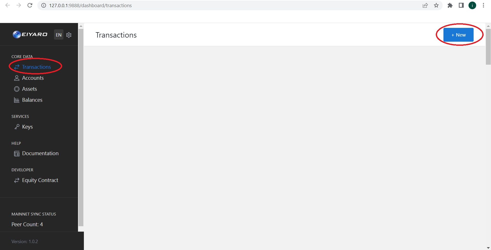
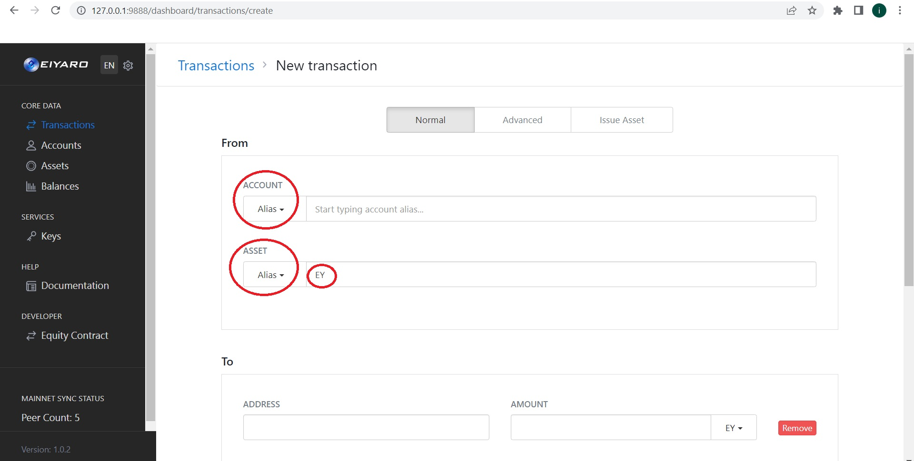

# 安装 EIYARO 节点的说明

要开始使用，请访问最新版本所在的链接 https://github.com/EIYARO-Project/core/releases
Н在编写本说明时，最新版本是 `EIYARO v1.0.3`.


在版本说明下方有下载链接。如果您是 Windows 用户，请选择 `eiyaro-1.0.3-windows_amd64.zip` 如果 Linux 系统的用户 `eiyaro-1.0.3-linux_amd64.tgz` 请注意，如果您是 Windows 用户，您的操作系统必须是 x64 位。关于 `32 位` noda 版本将无法使用！



将所选压缩包下载到电脑（如 D: 驱动器），使用任何压缩器（如 WinRAR）打开并解压文件 `eiyarod-windows_amd64.exe` 从存档到光盘。之后，存档 `eiyaro-1.0.3-windows_amd64.zip` 可删除.



接下来，我们进入菜单 "**开始**" 并选择 "**执行**". 在出现的窗口中输入 `cmd` 并按下 `OK`.



这时会打开一个命令行窗口。我们需要导航到文件所在的文件夹 `eiyarod-windows_amd64.exe` 在这种情况下，我们需要转到驱动器 `D:\` 为此，请在命令行中输入 `D:` 并按下 `ENTER`.


然后输入命令:
```console
> eiyarod-windows_amd64 init --chain_id mainnet 
```
并按下 `ENTER`.


现在我们再按一次 "**开始**" 并选择 "**执行**", 走进 `C:\Users\%username%\AppData\Roaming\Eiyaro\` 并按下 `OK`.


我们将打开一个文件夹 `EIYARO`, 有一个文件 `config.toml`, 右键单击，用记事本打开.



用以下文本替换记事本中的文件内容:

```toml
# This is a TOML config file.
# For more information, see https://github.com/toml-lang/toml
fast_sync = true
db_backend = "leveldb"
api_addr = "0.0.0.0:9888"
node_alias = "MyMostAwesomeNodeAlias"
moniker = "MyMostAwesomeNode"
chain_id = "mainnet"
[p2p]
laddr = "tcp://0.0.0.0:46657"
lan_discoverable = false
seeds = "148.135.99.102:46657,217.194.133.61:46657,154.201.78.187:46657,103.115.46.201:46657,154.44.8.62:46657,24.233.3.133:46657,27.25.156.254:46657"
keep_dial = "148.135.99.102:46657,217.194.133.61:46657,154.201.78.187:46657,103.115.46.201:46657,154.44.8.62:46657,24.233.3.133:46657,27.25.156.254:46657"
max_num_peers = 50
```

使其看起来像下面的截图，并保存文件.



之后，我们回到命令行, 输入命令:
```console
> eiyarod-windows_amd64 node
```
并按下 `ENTER`.


紧接着，我们将打开一个浏览器窗口（在我们的例子中，它是 `Chrome`). 

如果没有出现这种情况，请在文件中添加 `config.toml` 以下线路:

```toml
[web]
closed = true
```

使它看起来像这样:

```toml
# This is a TOML config file.
# For more information, see https://github.com/toml-lang/toml
fast_sync = true
db_backend = "leveldb"
api_addr = "0.0.0.0:9888"
node_alias = "MyMostAwesomeNodeAlias"
moniker = "MyMostAwesomeNode"
chain_id = "mainnet"
[p2p]
laddr = "tcp://0.0.0.0:46657"
lan_discoverable = false
seeds = "148.135.99.102:46657,217.194.133.61:46657,154.201.78.187:46657,103.115.46.201:46657,154.44.8.62:46657,24.233.3.133:46657,27.25.156.254:46657"
keep_dial = "148.135.99.102:46657,217.194.133.61:46657,154.201.78.187:46657,103.115.46.201:46657,154.44.8.62:46657,24.233.3.133:46657,27.25.156.254:46657"
max_num_peers = 50
[web]
closed = true
```

然后，返回命令行并输入命令:

```console
> eiyarod-windows_amd64 node
```
并按下 `ENTER`.

然后，在浏览器窗口中（在我们的例子中是 `Chrome`) 在地址栏中输入 http://127.0.0.1:9888/ 并按下 `ENTER`.

这将加载 EIYARO 网络界面页面，您需要选择 **Create Wallet** 创建钱包，或 **Restore by Mnemonic** 通过输入助记符短语来恢复钱包. 让我们选择 **Create Wallet** 并按下 **Create Wallet**.


在出现的窗口中，在字段中输入所需的账户名称 **ACCOUNT ALIAS** 和 **KEY ALIAS**, 您在字段中输入的密码 **KEY PASSWORD** 和 **REPEAT YOUR KEY PASSWORD**, 然后按下按钮 **Register**.



下一个窗口将为您提供 12 个字的记忆短语. 为方便起见，点击右侧记忆词旁边的图标，将记忆词复制到剪贴板，然后粘贴到记事本的文本文件中，并保存带有记忆词的文件.



不要将文件存储在连接到互联网的计算机上，也不要让您以外的其他人访问该文件. 最好将带有助记符短语的文本文件保存在单独的闪存盘上，或者最好保存在 3 个不同的闪存盘上，以防其中一个闪存盘出现故障.


要继续前进，请单击按钮 **I have written down the seed** 并在空白栏中输入记忆短语的缺失单词，然后按 **Confirm Seed**.


这是节点的网络界面. 请注意，首次运行时，它将使您的节点与网络上的节点同步 (左下 **MAINNET SYNC STATUS Synchronising**...), 这需要时间. 等待完全同步，之后您就可以在项目中查看余额了 **Balances** 中的交易列表 **Transactions**. 请勿关闭命令行窗口，否则同步将被中断，网络界面也将停止工作.



您可以在菜单项中找到您的钱包地址 **Accounts** 在这里您可以看到您的账户名称、账户 ID. 点击右侧 **View Details** 查看更多信息并找出您的钱包地址 `EIYARO`.


在下一页，您可以在最下方看到您的钱包地址.


要向另一个钱包发送资金，您需要选择菜单项 **Transactions** 您将看到收费情况，然后点击右上角的按钮 **+New** 创建新交易.



接下来，在第一个字段中 **Account** 输入您的账户名 (您在创建钱包时在字段中输入的内容 **Alias**), 而在第二个字段中 **Asset** - 信手拈来 "**EY**".



在下面的字段中输入地址 **ADDRESS**, 您将向其寄送资金，并在外地 **AMOUNT** 币数 `EY`, 然后按 **Submit transaction** 将硬币发送到指定地址.


