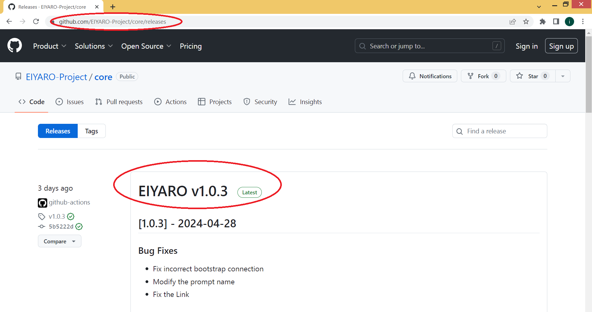
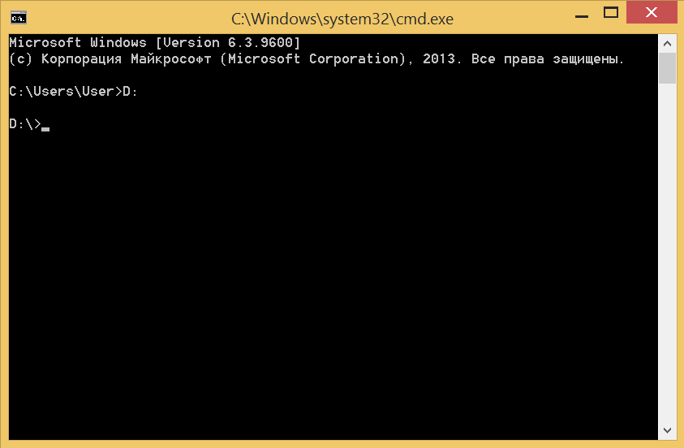
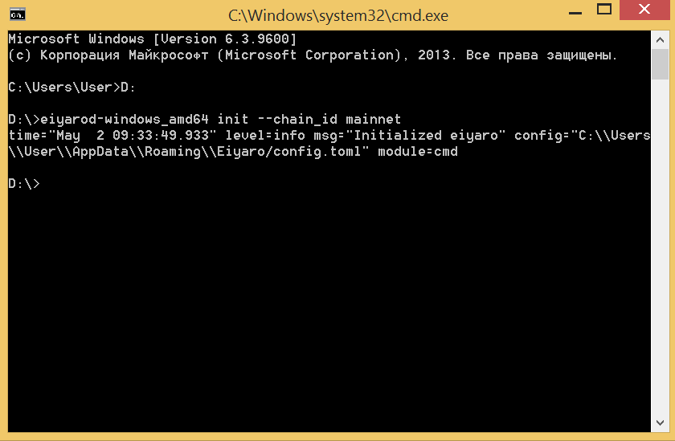
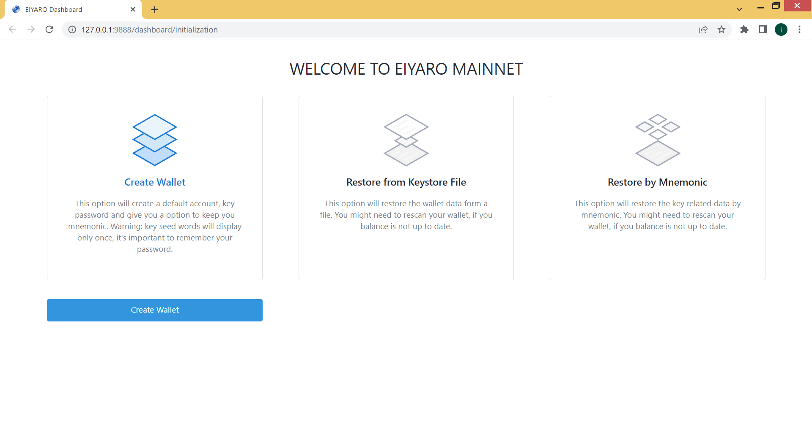
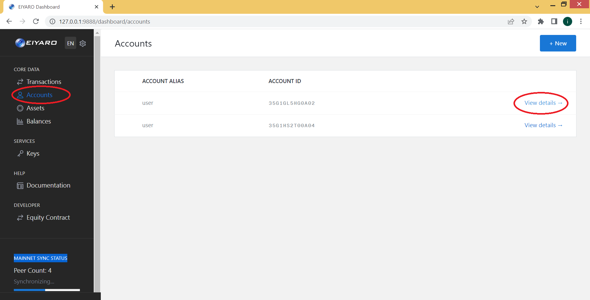
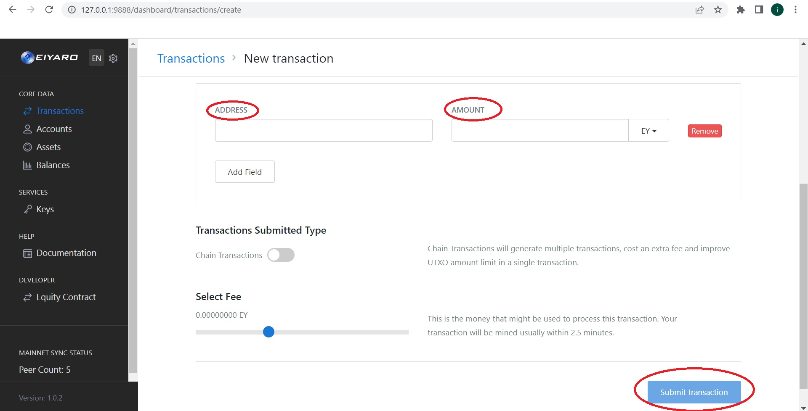

# Инструкция по установке ноды EIYARO

Для начала перейдите по ссылке, где находится самый свежий релиз https://github.com/EIYARO-Project/core/releases
На момент написания этой инструкции, самым свежим релизом является `EIYARO v1.0.3`.



Ниже под описанием релиза вы найдете ссылки для скачивания. Если вы пользователь Windows, выберите `eiyaro-1.0.3-windows_amd64.zip` если пользователь Linux-системы `eiyaro-1.0.3-linux_amd64.tgz` Имейте ввиду, что если вы пользователь Windows, ваша операционная система должна быть x64-битной. На `32-битных` версиях нода работать не будет!


Скачайте выбранный вами архив на ваш компьютер (например, на диск D:), откройте любым архиватором (например WinRAR) и извлеките файл `eiyarod-windows_amd64.exe` из архива на ваш диск. После этого архив `eiyaro-1.0.3-windows_amd64.zip` можно удалить.


Дальше мы заходим в меню "**Пуск**" и выбираем "**Выполнить**". В появившемся окне вводим `cmd` и жмем `OK`.


Открылось окно командной строки. Нам нужно перейти в папку, где находится ваш файл `eiyarod-windows_amd64.exe` В данном случае нам нужно перейти на диск `D:\` Для этого вводим в командной строке `D:` и жмем `ENTER`.



После чего вводим команду:
```console
> eiyarod-windows_amd64 init --chain_id mainnet 
```
и жмем `ENTER`.



Теперь снова жмем "**Пуск**" и выбираем "**Выполнить**", вводим `C:\Users\%username%\AppData\Roaming\Eiyaro\` и жмем `OK`.


У нас откроется папка `EIYARO`, в которой есть файл `config.toml`, нажмите на нем правой клавишей мыши и откройте с помощью Блокнота.


Замените содержимое файла в блокноте на следующий текст:

```toml
# This is a TOML config file.
# For more information, see https://github.com/toml-lang/toml
fast_sync = true
db_backend = "leveldb"
api_addr = "0.0.0.0:9888"
node_alias = "MyMostAwesomeNodeAlias"
moniker = "MyMostAwesomeNode"
chain_id = "mainnet"
[p2p]
laddr = "tcp://0.0.0.0:46657"
lan_discoverable = false
seeds = "148.135.99.102:46657,217.194.133.61:46657,154.201.78.187:46657,103.115.46.201:46657,154.44.8.62:46657,24.233.3.133:46657,27.25.156.254:46657"
keep_dial = "148.135.99.102:46657,217.194.133.61:46657,154.201.78.187:46657,103.115.46.201:46657,154.44.8.62:46657,24.233.3.133:46657,27.25.156.254:46657"
max_num_peers = 50
```

Чтобы получилось как на скриншоте ниже и сохраните файл.


После этого возвращаемся в командную строку, вводим команду:
```console
> eiyarod-windows_amd64 node
```
и жмем `ENTER`.


Сразу после этого у нас откроется окно браузера (в нашем случае, это `Chrome`), в котором вам нужно выбрать **Create Wallet** для создания кошелька, или **Restore by Mnemonic** для восстановления кошелька путем ввода мнемонической фразы. Выбираем **Create Wallet** и жмем **Create Wallet**.



В появившемся окне вводим желаемое имя аккаунта в поле **ACCOUNT ALIAS** и **KEY ALIAS**, придуманный вами пароль в поле **KEY PASSWORD** и **REPEAT YOUR KEY PASSWORD**, после чего нажимаем кнопку **Register**.


В следующем окне вам будет дана ваша мнемоническая фраза из 12 слов. Для удобства нажимаем на значок рядом со словом mnemonic справа, чтобы скопировать вашу мнемоническую фразу в буфер обмена, после чего вставьте ее в текстовый файл в блокноте и сохраните файл с вашей мнемонической фразой.


Не храните файл на компьютере, подключенном к интернету или доступ к которому имеет еще кто-то кроме вас. Лучше сохранить текстовый файл с мнемонической фразой на отдельной флешке, а лучше на 3-х разных флешках, на случай если одна из них выйдет из строя.


Чтобы перейти дальше, нажмите на кнопку **I have written down the seed** и введите недостающие слова вашей мнемонической фразы в пустые поля, после чего нажмите **Confirm Seed**.


Это веб-интерфейс вашей ноды. Обратите внимание, что при первом же запуске происходит синхронизация вашей ноды с узлами в сети (в нижнем левом углу **MAINNET SYNC STATUS Synchronising**...), и на это нужно время. Дождитесь полной синхронизации, после чего вы сможете посмотреть свой баланс в пункте **Balances** и список транзакций в пункте **Transactions**. Не закрывайте окно командной строки, иначе синхронизация прервется и веб-интерфейс перестанет работать.


Узнать адрес своего кошелька вы можете в пункте меню **Accounts** здесь вы можете увидеть ваше имя аккаунта, ID аккаунта. Нажмите справа **View Details** чтобы просмотреть более полную информацию а также узнать адрес вашего кошелька `EIYARO`.



На следующей странице вы можете увидеть адрес своего кошелька в самом низу.


Для отправки средств на другой кошелек вам нужно выбрать пункт меню **Transactions** где будут видны начисления и вверху справа нажать кнопку **+New** для того чтобы создать новую транзакцию.


Дальше в первом поле **Account** указываете имя своего аккаунта (то что указывали при создании кошелька в поле **Alias**), а во втором поле  **Asset** - просто пишите "**EY**".


Ниже вам нужно будет указать адрес в поле **ADDRESS**, на который вы отправляете средства и в поле **AMOUNT** количество монет `EY`, которые вы хотите отправить, после чего нажимайте **Submit transaction** для отправки монет на указанный адрес.


