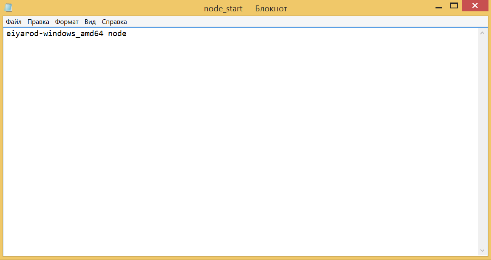

# Stratum Server Install Manual and Mining Guide

Now that the node is installed and synchronized with the network, you can start installing the miner. As of this writing, mining is only possible on NVIDIA graphics cards, so please keep that in mind.

Before proceeding, make sure your node is running again.


First we need to download the stratum-server. Go in your browser to this link https://github.com/EIYARO-Project/core-stratum-solo-binaries/releases, and select the latest release for download, for Windows users, it is `core-stratum-solo.v0.0.1-windows64.zip` and for Linux users, it is `core-stratum-solo.v0.0.1-linux64.tar.gz`.


Since this instruction is for Windows users, we download `core-stratum-solo.v0.0.1-windows64.zip` and extract the contents of the archive to the same folder where we have the node file `eiyarod-windows_amd64`, after which the archive `core-stratum-solo.v0.0.1-windows64.zip` can be deleted.


Next, we go to the **Start** menu, and select **Run**. In the window that appears, type `cmd` and click **OK**.


A command line window opens. We need to go to the folder where your `eiyarostratum.exe` file is located. In this case, we need to go to the `D:\` drive. To do this, enter `D:` in the command line and press `ENTER`. Then enter the command `eiyarostratum -config prod.yml` and press `ENTER` again.


The stratum server is running. Do not close the command line window of the node and stratum-server.

Now follow the link in your browser https://github.com/trexminer/T-Rex/releases/tag/0.26.8 and download the `T-Rex` miner release, for Windows users it's `t-rex-0.26.8-win.zip`, and for Unix users it's `t-rex-0.26.8-linux.tar.gz`.


We download `t-rex-0.26.8-win.zip`, open it with any archiver (e.g. `WinRAR`) and extract the file `t-rex.exe` from it to the same folder where we have files of node `eiyarod-windows_amd64.exe` and stratum-server `eiyarostratum.exe`. After that the archive `t-rex-0.26.8-win.zip` can be deleted.


Now go to the **Start** menu again and select **Run**. In the window that appears, type `notepad` and click **OK**.


In the `Notepad` window that appears, enter the following content:
```
t-rex.exe -a tensority -o startum+tcp://127.0.0.1:9119 -u DoesntMatter --coin EIYARO -w NeverMind
```


Next, in the `Notepad` window, click "**File**" and select "**Save As...**".


In the window that appears, at the bottom, in the field opposite "**File name:**" enter `EIYARO.bat`, and in the field opposite "**File type:**" select "**All files**" and click **Save** and save to the same folder where we have a file miner `t-rex.exe`, that is, on disk `D:`.


Now that you have the node and stratum server window running, open the `EIAYRO.bat` file.


Mining is up and running!


You can view the reward for the found block in the web interface of the node, in the **Transactions** item.


If you are not mining all the time but occasionally, for convenience you can also create .bat files to start the node and to start the stratum server:




And you can run them one by one: first `node_start.bat`, then `stratum_start.bat`, then `EIYARO.bat`.