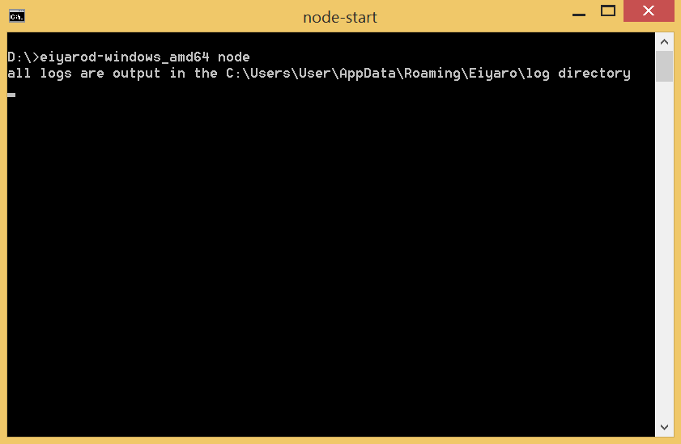
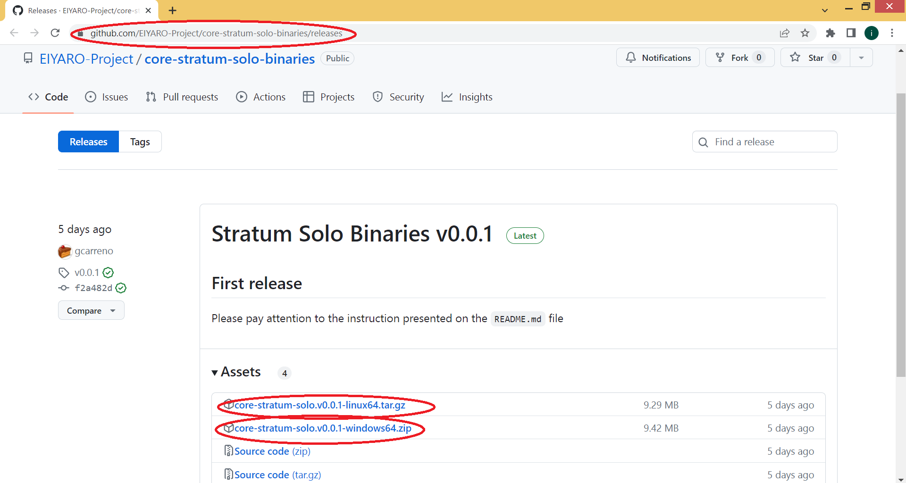
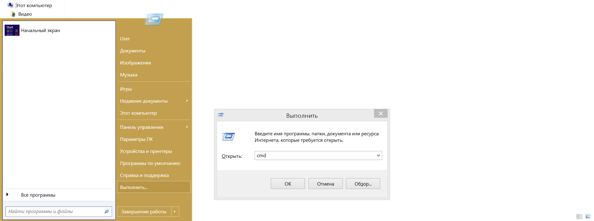
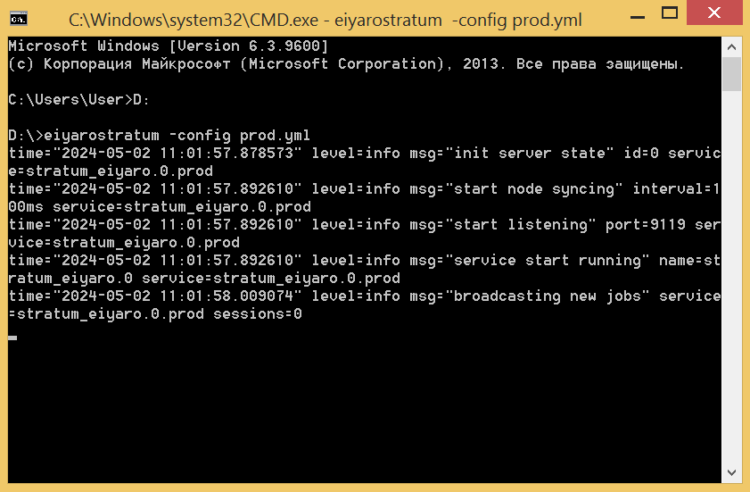
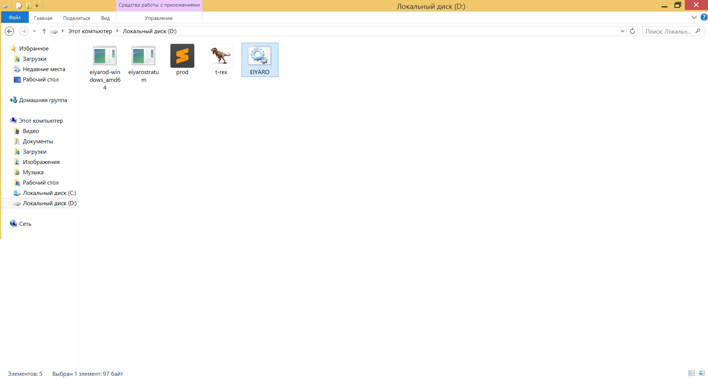

# Stratum 服务器安装和 EIYARO 采矿说明

现在，节点已安装完毕并与网络同步，你可以开始安装矿工了. 在编写本手册时，只有英伟达™（NVIDIA®）显卡才能进行挖矿，请记住这一点.

在继续之前，请确保您的节点已重新运行.



首先，我们需要下载 stratum 服务器. 在浏览器中访问此链接 https://github.com/EIYARO-Project/core-stratum-solo-binaries/releases, 并选择要下载的最新版本，对于 Windows 用户, 此 `core-stratum-solo.v0.0.1-windows64.zip` 而对于 Linux 用户，它是 `core-stratum-solo.v0.0.1-linux64.tar.gz`.



由于本说明适用于 Windows 用户，我们将下载 `core-stratum-solo.v0.0.1-windows64.zip` 由于本说明适用于 Windows 用户，我们将下载 `eiyarod-windows_amd64`, 之后 `core-stratum-solo.v0.0.1-windows64.zip` 可删除.


接下来，我们进入菜单 **Пуск**, 并选择 **执行**. 在出现的窗口中输入 `cmd` 并按下 **OK**.



打开命令行窗口. 我们需要进入文件所在的文件夹 `eiyarostratum.exe`. 在这种情况下，我们需要转到驱动器 `D:\`. 为此，请在命令行中输入 `D:` 并按下 `ENTER`. 然后输入命令 `eiyarostratum -config prod.yml` 再按一次 `ENTER`.



Stratum 服务器已启动并运行. 不要关闭节点和分层服务器命令行窗口.

现在点击浏览器中的链接 https://github.com/trexminer/T-Rex/releases/tag/0.26.8 并下载发布稿 `T-Rex` 矿工, 适用于 Windows 用户 `t-rex-0.26.8-win.zip`, 而对于 Unix 用户则是 `t-rex-0.26.8-linux.tar.gz`.


我们正在下载 `t-rex-0.26.8-win.zip`, 用任何存档软件打开 (例如 `WinRAR`) 并从中提取文件 `t-rex.exe` 到存放节点文件的同一文件夹中 `eiyarod-windows_amd64.exe` 和 Stratum 服务器 `eiyarostratum.exe`. 之后，档案 `t-rex-0.26.8-win.zip` 可删除.


现在我们回到菜单 **开始** 并选择 **执行**. 在出现的窗口中输入 `notepad` 并按下 **OK**.


在出现的窗口中 `Notepad`, 输入以下内容:
```
t-rex.exe -a tensority -o startum+tcp://127.0.0.1:9119 -u DoesntMatter --coin EIYARO -w NeverMind
```


再往下是窗户 `Notepad` 单击 "**文件**" 并选择 "**另存为...**".


在出现的窗口中，在窗口下部与 "**文件名称：**" 走进 `EIYARO.bat`, 在对面的田野里 "**文件类型:**" 遴选 "**所有文件**" 并按下 **节省** 并将其保存到矿工文件所在的同一文件夹中 `t-rex.exe`, 即光盘 `D:`.


现在节点和分层服务器窗口已经运行，打开文件 `EIAYRO.bat`.



采矿已启动并运行！


您可以在节点的网络界面中查看找到的区块的奖励，在项目 **交易**.


如果您不是经常采矿，而是偶尔采矿，为了方便起见，您也可以创建 .bat 文件来启动节点和 Stratum 服务器：


您可以一次运行一个：第一个 `node_start.bat`, 然后 `stratum_start.bat`, 然后 `EIYARO.bat`.

