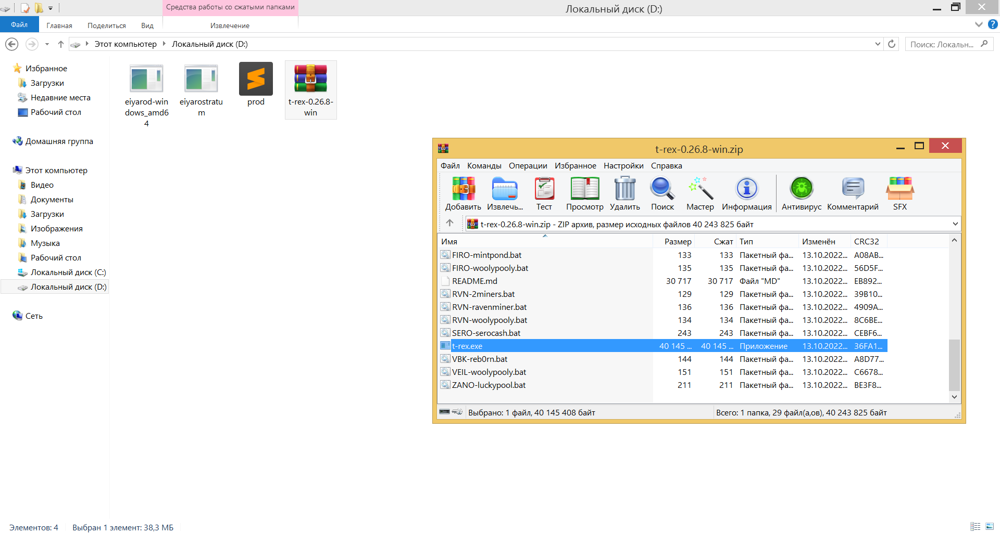
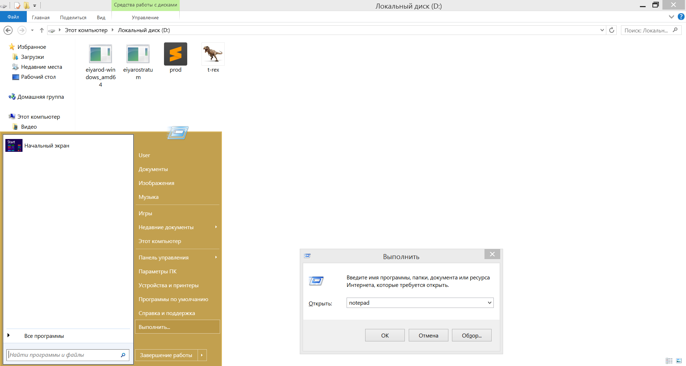
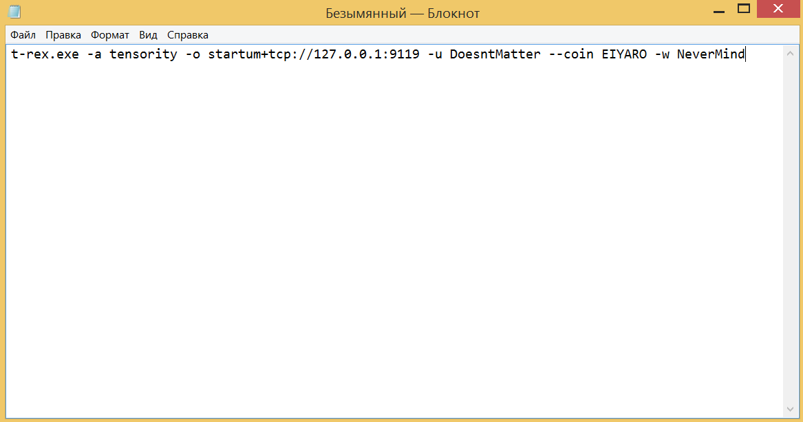
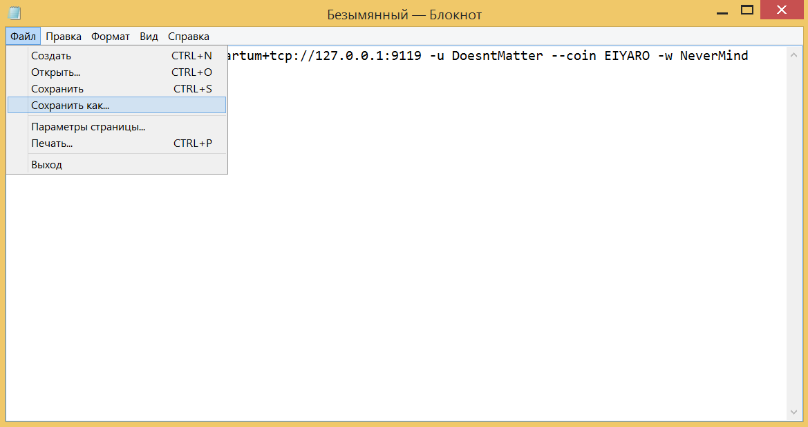
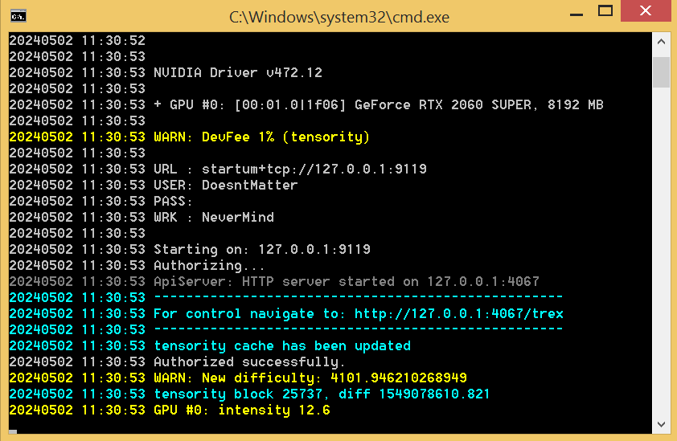
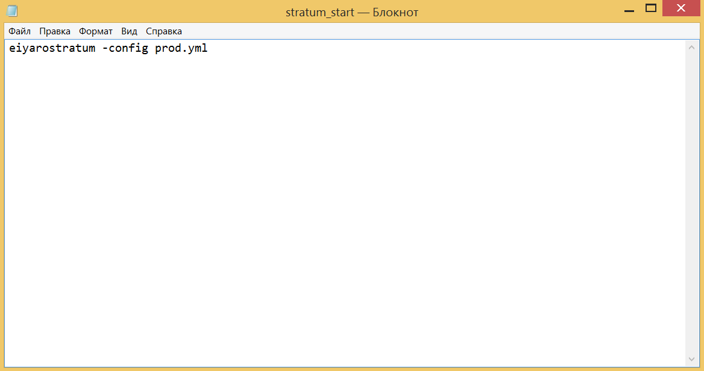

# Инструкция по установке сервера Stratum и майнингу EIYARO

Теперь, когда нода установлена и синхронизована с сетью можно приступать к установке майнера. На момент написания данной инструкции майнинг возможен только на видеокартах NVIDIA, пожалуйста имейте это ввиду.

Перед тем как продолжить, убедитесь что ваша нода снова запущена.


Для начала нам нужно скачать стратум-сервер. Переходим в браузере по данной ссылке https://github.com/EIYARO-Project/core-stratum-solo-binaries/releases, и выбираем свежий релиз для скачивания, для пользователей Windows, это `core-stratum-solo.v0.0.1-windows64.zip` а для пользователей Linux, это `core-stratum-solo.v0.0.1-linux64.tar.gz`.


Поскольку данная инструкция для пользователей Windows, мы скачиваем `core-stratum-solo.v0.0.1-windows64.zip` и извлекаем содержимое архива в ту же папку, где у нас находится файл ноды `eiyarod-windows_amd64`, после чего архив `core-stratum-solo.v0.0.1-windows64.zip` можно удалить.


Дальше мы заходим в меню **Пуск**, и выбираем **Выполнить**. В появившемся окне вводим `cmd` и жмем **OK**.


Открылось окно командной строки. Нам нужно перейти в папку, где находится ваш файл `eiyarostratum.exe`. В данном случае нам нужно перейти на диск `D:\`. Для этого вводим в командной строке `D:` и жмем `ENTER`. После чего вводим команду `eiyarostratum -config prod.yml` и снова жмем `ENTER`.


Стратум-сервер запущен. Не закрывайте окно командной строки ноды и стратум-сервера.

Теперь переходим по ссылке в браузере https://github.com/trexminer/T-Rex/releases/tag/0.26.8 и скачиваем релиз `T-Rex` майнера, для пользователей Windows `t-rex-0.26.8-win.zip`, а для пользователей Unix это `t-rex-0.26.8-linux.tar.gz`.


Мы скачиваем `t-rex-0.26.8-win.zip`, открываем его любым архиватором (например `WinRAR`) и извлекаем из него файл `t-rex.exe` в ту же папку, где у нас находятся файлы ноды `eiyarod-windows_amd64.exe` и стратум-сервера `eiyarostratum.exe`. После чего архив `t-rex-0.26.8-win.zip` можно удалить.



Теперь снова заходим в меню **Пуск** и выбираем **Выполнить**. В появившемся окне вводим `notepad` и жмем **OK**.



В появившемся окне `Notepad`, вводим следующее содержимое:
```
t-rex.exe -a tensority -o startum+tcp://127.0.0.1:9119 -u DoesntMatter --coin EIYARO -w NeverMind
```



Дальше в окне `Notepad` жмем "**Файл**" и выбираем "**Сохранить как...**".



В появившемся окне, в нижней части, в поле напротив "**Имя файла:**" вводим `EIYARO.bat`, в поле напротив "**Тип файла:**" выбираем "**Все файлы**" и жмем **Cохранить** и сохраняем в ту же папку, где у нас находится файл майнера `t-rex.exe`, то есть на диск `D:`.


Теперь когда у вас запущено окно ноды и стратум-сервера, открываем файл `EIAYRO.bat`.


Майнинг запущен!



Вознаграждение за найденный блок вы можете просмотреть в веб-интерфейсе ноды, в пункте **Транзакции**.


Если вы майните не постоянно, а время от времени, для удобства вы можете также создать .bat файлы для запуска ноды и для запуска стратум-сервера:




И можете запускать их по очереди: сначала `node_start.bat`, затем `stratum_start.bat`, потом `EIYARO.bat`.

